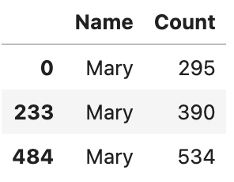
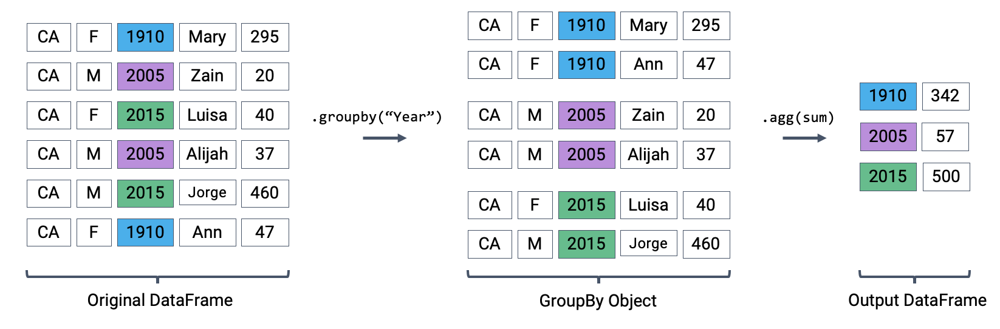

---
jupyter:
  jupytext:
    notebook_metadata_filter: all,-language_info
    split_at_heading: true
    text_representation:
      extension: .Rmd
      format_name: rmarkdown
      format_version: '1.2'
      jupytext_version: 1.15.2
  kernelspec:
    display_name: Python 3 (ipykernel)
    language: python
    name: python3
---

# Lecture 3 – Data 100, Fall 2023

Data 100, Fall 2023

[Acknowledgments Page](https://ds100.org/fa23/acks/)

A demonstration of advanced `pandas` syntax to accompany Lecture 3.

```{python}
import numpy as np
import pandas as pd
import plotly.express as px
```

```{python}
# Loading the elections DataFrame
elections = pd.read_csv("../data/elections.csv")

elections.head() 
```

## Data Extraction in `Pandas`
### Integer-Based Extraction Using `iloc`


`iloc` selects items by row and column *integer* position.

Arguments to `.iloc` can be:
1. A list.
2. A slice (syntax is exclusive of the right hand side of the slice).
3. A single value.


```{python}
# Select the rows at positions 1, 2, and 3.
# Select the columns at positions 0, 1, and 2.
# Remember that Python indexing begins at position 0!
elections.iloc[[1, 2, 3], [0, 1, 2]]
```

```{python}
# Index-based extraction using a list of rows and a slice of column indices
elections.iloc[[1, 2, 3], 0:3]
```

```{python}
# Selecting all rows using a colon
elections.iloc[:, 0:3]
```

```{python}
elections.iloc[[1, 2, 3], 1]
```

```{python}
# Extracting the value at row 0 and the second column
elections.iloc[0,1]
```

### Context-dependent Extraction using `[]`


We could technically do anything we want using `loc` or `iloc`. However, in practice, the `[]` operator is often used instead to yield more concise code.

`[]` is a bit trickier to understand than `loc` or `iloc`, but it achieves essentially the same functionality. The difference is that `[]` is *context-dependent*.

`[]` only takes one argument, which may be:
1. A slice of row integers.
2. A list of column labels.
3. A single column label.


If we provide a slice of row numbers, we get the numbered rows.

```{python}
elections[3:7]
```

If we provide a list of column names, we get the listed columns.

```{python}
elections[["Year", "Candidate", "Result"]]
```

And if we provide a single column name we get back just that column, stored as a `Series`.

```{python}
elections["Candidate"]
```

#### Slido Exercise

```{python}
weird = pd.DataFrame({
    1:["topdog","botdog"], 
    "1":["topcat","botcat"]
})
weird
```

```{python}
weird[1]
```

```{python}
weird["1"]
```

```{python}
weird[1:]
```

## Dataset: California baby names

In today's lecture, we'll work with the `babynames` dataset, which contains information about the names of infants born in California.

```{python}
# Notice the compressed suffix for the filename.
babynames = pd.read_csv('../data/notrare_babynames.csv.gz')

babynames.head()
```

## Conditional Selection

```{python}
# Ask yourself: Why is :9 is the correct slice to select the first 10 rows?
babynames_first_10_rows = babynames.loc[:9, :]

babynames_first_10_rows
```

By passing in a sequence (list, array, or `Series`) of boolean values, we can extract a subset of the rows in a `DataFrame`. We will keep *only* the rows that correspond to a boolean value of `True`.

```{python}
# Notice how we have exactly 10 elements in our boolean array argument.
babynames_first_10_rows[[True, False, True, False, True, False, True, False, True, False]]
```

```{python}
# Or using .loc to filter a DataFrame by a Boolean array argument
babynames_first_10_rows.loc[[True, False, True, False, True, False, True, False, True, False], :]

```

Oftentimes, we'll use boolean selection to check for entries in a `DataFrame` that meet a particular condition.

```{python}
# First, use a logical condition to generate a boolean Series
logical_operator = (babynames["Sex"] == "F")
logical_operator
```

```{python}
# Then, use this boolean Series to filter the DataFrame
babynames[logical_operator]
```

Boolean selection also works with `loc`!

```{python}
# Notice that we did not have to specify columns to select 
# If no columns are referenced, pandas will automatically select all columns
babynames.loc[babynames["Sex"] == "F"]
```

### Bitwise Operators


To filter on multiple conditions, we combine boolean operators using **bitwise comparisons**.

Symbol | Usage      | Meaning 
------ | ---------- | -------------------------------------
~    | ~p       | Returns negation of p
&#124; | p &#124; q | p OR q
&    | p & q    | p AND q
^  | p ^ q | p XOR q (exclusive or)

```{python}
babynames[(babynames["Sex"] == "F") & (babynames["Year"] < 2000)]
```

```{python}
babynames[(babynames["Sex"] == "F") | (babynames["Year"] < 2000)]
```

### Slido Exercises
We want to obtain the first three baby names with `count > 250`.



```{python}
babynames.iloc[[0, 233, 484], [3, 4]]
```

```{python}
babynames.loc[[0, 233, 484]]
```

```{python}
babynames.loc[babynames["Count"] > 250, ["Name", "Count"]].head(3)
```

```{python}
babynames.loc[babynames["Count"] > 250, ["Name", "Count"]].iloc[0:2, :]
```

### `.isin` for Selection based on a list, array, or `Series` 

```{python}
# Note: The parentheses surrounding the code make it possible to break the code into multiple lines for readability

(
    babynames[(babynames["Name"] == "Bella") | 
              (babynames["Name"] == "Alex") |
              (babynames["Name"] == "Narges") |
              (babynames["Name"] == "Lisa")]
)

```

```{python}
# A more concise method to achieve the above: .isin
names = ["Bella", "Alex", "Narges", "Lisa"]
display(babynames["Name"].isin(names))
display(babynames[babynames["Name"].isin(names)])
```

### `.str` Functions for Defining a Condition

```{python}
# What if we only want names that start with "N"?
display(babynames["Name"].str.startswith("N"))
display(babynames[babynames["Name"].str.startswith("N")])
```

## Adding, Removing, and Modifying Columns

### Add a Column
To add a column, use `[]` to reference the desired new column, then assign it to a `Series` or array of appropriate length.

```{python}
# Create a Series of the length of each name
babyname_lengths = babynames["Name"].str.len()

# Add a column named "name_lengths" that includes the length of each name
babynames["name_lengths"] = babyname_lengths

babynames
```

### Modify a Column
To modify a column, use `[]` to access the desired column, then re-assign it to a new array or Series.

```{python}
# Modify the "name_lengths" column to be one less than its original value
babynames["name_lengths"] = babynames["name_lengths"] - 1
babynames
```

### Rename a Column Name
Rename a column using the `.rename()` method.

```{python}
# Rename "name_lengths" to "Length"
babynames = babynames.rename(columns={"name_lengths":"Length"})
babynames
```

### Delete a Column
Remove a column using `.drop()`.

```{python}
# Remove our new "Length" column
babynames = babynames.drop("Length", axis="columns")
babynames
```

## Useful Utility Functions

### `NumPy`


The `NumPy` functions you encountered in [Data 8](https://www.data8.org/su23/reference/#array-functions-and-methods) are compatible with objects in `pandas`. 

```{python}
yash_counts = babynames[babynames["Name"] == "Yash"]["Count"]
yash_counts
```

```{python}
# Average number of babies named Yash each year

np.mean(yash_counts)
```

```{python}
# Max number of babies named Yash born in any single year

max(yash_counts)
```

### Built-In `pandas` Methods

There are many, *many* utility functions built into `pandas`, far more than we can possibly cover in lecture. You are encouraged to explore all the functionality outlined in the `pandas` [documentation](https://pandas.pydata.org/docs/reference/index.html).

```{python}
# Returns the shape of the object in the format (num_rows, num_columns)
babynames.shape
```

```{python}
# Returns the total number of entries in the object, equal to num_rows * num_columns
babynames.size
```

```{python}
# What summary statistics can we describe?
babynames.describe()
```

```{python}
# Our statistics are slightly different when working with a Series
babynames["Sex"].describe()
```

```{python}
# Randomly sample row(s) from the DataFrame
babynames.sample()
```

```{python}
# Rerun this cell a few times – you'll get different results!
babynames.sample(5).iloc[:, 2:]
```

```{python}
# Sampling with replacement
babynames[babynames["Year"] == 2000].sample(4, replace = True).iloc[:,2:]
```

```{python}
# Count the number of times each unique value occurs in a Series
babynames["Name"].value_counts()
```

```{python}
# Return an array of all unique values in the Series
babynames["Name"].unique()
```

```{python}
# Sort a Series
babynames["Name"].sort_values()
```

```{python}
# Sort a DataFrame – there are lots of Michaels in California
babynames.sort_values(by = "Count", ascending = False)
```

<!-- #region -->
## Custom sorting

### Approach 1: Create a temporary column
<!-- #endregion -->

```{python}
# Create a Series of the length of each name
babyname_lengths = babynames["Name"].str.len()

# Add a column named "name_lengths" that includes the length of each name
babynames["name_lengths"] = babyname_lengths
babynames.head(5)
```

```{python}
# Sort by the temporary column
babynames = babynames.sort_values(by = "name_lengths", ascending=False)
babynames.head(5)
```

```{python}
# Drop the 'name_length' column
babynames = babynames.drop("name_lengths", axis = 'columns')
babynames.head(5)
```

### Approach 2: Sorting using the `key` argument

```{python}
babynames.sort_values("Name", key = lambda x:x.str.len(), ascending = False).head()
```

### Approach 3: Sorting Using the `map` Function

We can also use the Python map function if we want to use an arbitrarily defined function. Suppose we want to sort by the number of occurrences of "dr" plus the number of occurences of "ea".

```{python}
# First, define a function to count the number of times "dr" or "ea" appear in each name
def dr_ea_count(string):
    return string.count('dr') + string.count('ea')

# Then, use `map` to apply `dr_ea_count` to each name in the "Name" column
babynames["dr_ea_count"] = babynames["Name"].map(dr_ea_count)

# Sort the DataFrame by the new "dr_ea_count" column so we can see our handiwork
babynames = babynames.sort_values(by = "dr_ea_count", ascending=False)
babynames.head()
```

```{python}
# Drop the `dr_ea_count` column
babynames = babynames.drop("dr_ea_count", axis = 'columns')
babynames.head(5)
```

## Grouping

Group rows that share a common feature, then aggregate data across the group.

In this example, we count the total number of babies born in each year (considering only a small subset of the data, for simplicity).



```{python}
# The code below uses the full babynames dataset, which is why some numbers are different relative to the diagram
babynames[["Year", "Count"]].groupby("Year").agg(sum)
```

There are many different aggregation functions we can use, all of which are useful in different applications.

```{python}
# What is the earliest year in which each name appeared?
babynames.groupby("Name")[["Year"]].agg(min)
```

```{python}
# What is the largest single-year count of each name?
babynames.groupby("Name")[["Count"]].agg(max)
```

## Case Study: Name "Popularity"


In this exercise, let's find the name with sex "F" that has dropped most in popularity since its peak usage. We'll start by filtering `babynames` to only include names corresponding to sex "F".

```{python}
f_babynames = babynames[babynames["Sex"] == "F"]
f_babynames
```

```{python}
# We sort the data by year
f_babynames = f_babynames.sort_values("Year")
f_babynames
```

To build our intuition on how to answer our research question, let's visualize the prevalence of the name "Jennifer" over time.

```{python}
# We'll talk about how to generate plots in a later lecture
fig = px.line(f_babynames[f_babynames["Name"] == "Jennifer"],
              x = "Year", y = "Count")
fig.update_layout(font_size = 18, 
                  autosize=False, 
                  width=1000, 
                  height=400)
```

We'll need a mathematical definition for the change in popularity of a name.

Define the metric "ratio to peak" (RTP). We'll calculate this as the count of the name in 2022 (the most recent year for which we have data) divided by the largest count of this name in *any* year. 

A demo calculation for Jennifer:

```{python}
# In the year with the highest Jennifer count, 6065 Jennifers were born
max_jenn = np.max(f_babynames[f_babynames["Name"] == "Jennifer"]["Count"])
max_jenn
```

```{python}
# Remember that we sorted f_babynames by year. 
# This means that grabbing the final entry gives us the most recent count of Jennifers: 114
# In 2022, the most recent year for which we have data, 114 Jennifers were born
curr_jenn = f_babynames[f_babynames["Name"] == "Jennifer"]["Count"].iloc[-1]
curr_jenn
```

```{python}
# Compute the RTP
curr_jenn / max_jenn
```

We can also write a function that produces the `ratio_to_peak`for a given `Series`. This will allow us to use `.groupby` to speed up our computation for all names in the dataset.

```{python}
def ratio_to_peak(series):
    """
    Compute the RTP for a Series containing the counts per year for a single name
    """
    return series.iloc[-1] / np.max(series)
```

```{python}
# Construct a Series containing our Jennifer count data
jenn_counts_ser = f_babynames[f_babynames["Name"] == "Jennifer"]["Count"]

# Then, find the RTP
ratio_to_peak(jenn_counts_ser)
```

Now, let's use `.groupby` to compute the RTPs for *all* names in the dataset.

You may see a warning message when running the cell below. As discussed in lecture, `pandas` can't apply an aggregation function to non-numeric data (it doens't make sense to divide "CA" by a number). By default, `.groupby` will drop any columns that cannot be aggregated.

```{python}
rtp_table = f_babynames.groupby("Name")[["Year", "Count"]].agg(ratio_to_peak)
rtp_table
```

```{python}
# Results in a TypeError
# rtp_table = f_babynames.groupby("Name").agg(ratio_to_peak)
# rtp_table
```

This is the `pandas` equivalent of `.group` from [Data 8](http://data8.org/datascience/_autosummary/datascience.tables.Table.group.html). If we wanted to achieve this same result using the `datascience` library, we would write:

`f_babynames.group("Name", ratio_to_peak)`


To avoid the warning message above, we explicitly extract only the columns relevant to our analysis before using `.agg`.

```{python}
# Recompute the RTPs, but only performing the calculation on the "Count" column
rtp_table = f_babynames.groupby("Name")[["Count"]].agg(ratio_to_peak)
rtp_table
```

```{python}
# Rename "Count" to "Count RTP" for clarity
rtp_table = rtp_table.rename(columns = {"Count": "Count RTP"})
rtp_table
```

```{python}
# What name has fallen the most in popularity?
rtp_table.sort_values("Count RTP")
```

We can visualize the decrease in the popularity of the name "Debra:"

```{python}
def plot_name(*names):
    fig = px.line(f_babynames[f_babynames["Name"].isin(names)], 
                  x = "Year", y = "Count", color="Name",
                  title=f"Popularity for: {names}")
    fig.update_layout(font_size = 18, 
                  autosize=False, 
                  width=1000, 
                  height=400)
    return fig

plot_name("Debra")
```

```{python}
# Find the 10 names that have decreased the most in popularity
top10 = rtp_table.sort_values("Count RTP").head(10).index
top10
```

```{python}
plot_name(*top10)
```

For fun, try plotting your name or your friends' names.
