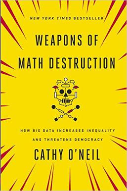
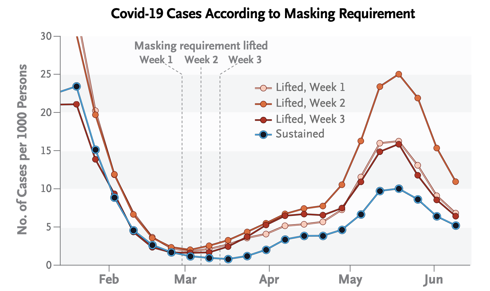
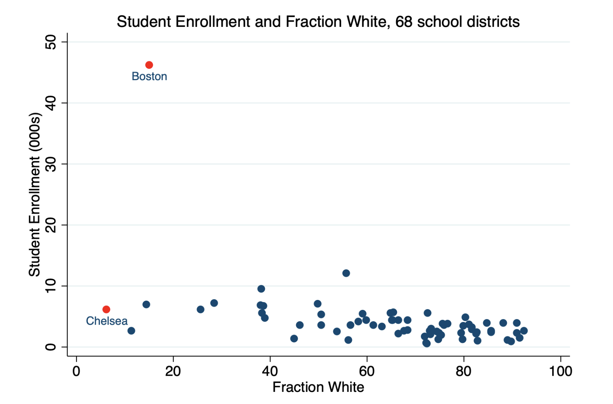
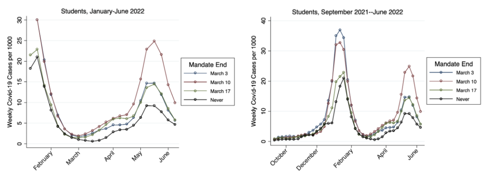
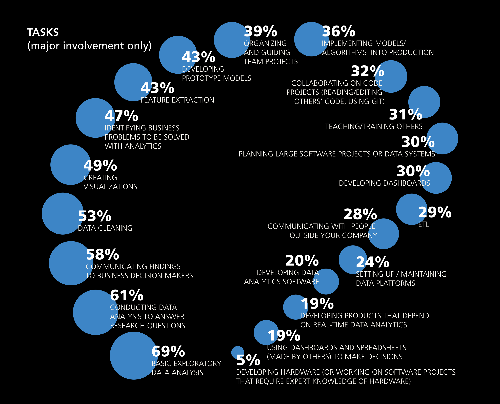

---
# YAML metadata
title: "Data Science and Machine Learning in Practice"
author: "Matthew Brett"
linkcolor: blue
urlcolor: blue
bibliography: refs.bib
---

# Introduction

We have two tasks:

* "Data science and machine learning" - go deeper into the world of data
  science analysis.
* "in practice" - learn how to collaborate with tools for code.

We will call this course DSIP for Data Science in Practice.

Some parts of this talk come from [the DS100 introduction slide
deck](https://ds100.org/fa23/lecture/lec01), covered by a [CC-By-NC-SA
license](https://creativecommons.org/licenses/by-nc-sa/4.0/) with thanks.

# Course construction

1. Getting you to the starting level of the Berkeley
   [DS100](https://learningds.org) course.
2. We will work through a considerable part the DS100 content, mixed with new
   content from [our LIS data science
   textbook](https://lisds.github.com/textbook), and some extra material from the nascent [The course textbook](https://lisds.github.com/dsip)
3. We will also cover collaboration and reproducible coding from [another
   Berkeley course](https://www.jarrodmillman.com/rcsds) from the data science
   series, that I (MB) designed and taught with [Jarrod
   Millman](https://www.jarrodmillman.com/), in 2015, and multiple times since
   then. Here's the [write-up of the
   course](https://doi.org/10.3389%2Ffnins.2018.00727). out.

# Starting level of the DS100 course

There are two prerequisites that we'll need to cover:

* Expressing data science models in mathematical form.
* A few more building blocks for coding.

We will cover these in the first week or so.

# Collaboration and reproducible coding

* Data science is hard — to get right.
* To get it right, you'll need your peers.
* Collaboration with notebooks is hard.
* There are very good tools for collaboration using other tools.
* We will start to talk about these tools soon.

# Data Science as critical thinking

_The world is complicated! Decisions are hard._

Data is used everywhere to answer hard questions and make tough decisions:

* Science
* Medicine
* Social science
* Engineering
* Sports

Claims about data come up in discussing almost any important issue:

Instead of " _[Aquinas](https://en.wikipedia.org/wiki/Thomas_Aquinas)_  says,"
now it’s "the data says."

It is usually not easy to tell what the data "says".

If you want to be able to make independent judgments about the modern world
— you will need data science.

# The dark side

{height=70%}

[Author interview](https://www.npr.org/2016/09/12/493654950/weapons-of-math-destruction-outlines-dangers-of-relying-on-data-analytics) with Cathy O’Neil

# The dark side

Obscuring complex decisions:

* Mortgage-backed securities → market crash
* Teaching scores & job advancement
* Reinforcing historical trends and biases:
* Hiring based on previous hiring data
* Recidivism and racially biased sentencing
* Social media, news, and politics

# Avoiding error

_The world is complicated\! Decisions are hard._

* Data science is a fundamentally human-centered field that facilitates
  decision-making by quantitatively balancing tradeoffs.
* To quantify things _reliably_ — we must:
  * _Find_  relevant data;
  * Recognize its  _limitations_ ;
  * Ask the right  _questions_ ;
  * Make reasonable  _assumptions_ ;
  * Conduct an appropriate  _analysis_ ; and
  * _Synthesize and explain_  our insights\.
* Apply _critical thinking and skepticism_ at every step; and
* Consider how our decisions  _affect others_.

# Covid vaccine boosters

> Death due to Covid-19 occurred in 65 participants in the booster group (0.16
per 100,000 persons per day) and in 137 participants in the non-booster group
(2.98 per 100,000 persons per day) Participants who received a booster at least
5 months after a second dose of [the Pfizer vaccine] had 90% lower mortality
due to Covid-19 than participants who did not receive a booster.

[@arbel2021bnt162b2]

# Limitations of Covid vaccine booster study

> The authors reply: In response to Rohban: during our study period, 506 deaths
occurred in the booster group (441 deaths were not related to Covid-19 and 65
were Covid-19–related), as compared with 1100 deaths in the non-booster group
(963 deaths were not related to Covid-19 and 137 were Covid-19–related).

[@arbel2022authors]

> This corresponds to a 94.8% lower mortality not related to Covid-19 among
participants in the booster group and indicates a markedly lower incidence of
adverse health outcomes in the booster group.

[@hoeg2023vaccinee_bias] (and [Github
repository](https://github.com/tracybethhoeg/bostonmaskstudy-reanalysis))

# Mask mandates for Covid

{height=60%}

["Universal Masking in School Works. New Data Shows How
Well"](https://time.com/6231516/universal-masking-in-school-works-new-data-shows-how-well)

[@cowger2022lifting]

# Limitations of mask mandate study

[@hoeg2023mask]

# Limitations of mask mandate study

[@hoeg2023mask]

# The work of data science

From the [O'Reilly 2016 data science
salary survey](https://www.oreilly.com/radar/2016-data-science-salary-survey-results/)

{width=80%}

# Data Science Requires Engineering and Scientific Insight

_Good data analysis is not_:

* Simple application of a statistics recipe.
* Simple application of statistical software.

There are many  __tools__  out there for data science, but they are merely
tools.

_They don’t do any of the important thinking!_

“The purpose of computing is insight, not numbers.” [@hamming2012numerical].

# The data Science Lifecycle

The data science lifecycle is a _high-level description_ of the data science
workflow.

{width=60%}

Note the two distinct entry points!

# 1. Question/Problem Formulation

* What do we want to know?
* What problems are we trying to solve?
* What hypotheses do we want to test?
* What are our metrics for success?

{width=60%}

# 2. Data Acquisition and Cleaning

* What data do we have and what data do we need?
* How will we sample more data?
* Is our data representative of the population we want to study?

{width=60%}

# 3. Exploratory Data Analysis & Visualization

* How is our data organized and what does it contain?
* Do we already have relevant data?
* What are the biases, anomalies, or other issues with the data?
* How do we transform the data to enable effective analysis?

{width=60%}

# 4. Prediction and Inference

* What does the data say about the world?
* Does it answer our questions or accurately solve the problem?
* How robust are our conclusions and can we trust the predictions?

{width=60%}

# Some introductions

* [Matthew Brett](https://matthew.dynevor.org)
* [Peter Rush](https://github.com/pxr687)

# On humility

> The competent programmer is fully aware of the strictly limited size of his
own skull; therefore he approaches the programming task in full humility, and
among other things he avoids clever tricks like the plague. ...
>
> ... Programming will remain very difficult, because once we have freed
ourselves from the circumstantial cumbersomeness, we will find ourselves free
to tackle the problems that are now well beyond our programming capacity....
>
> ...We shall do a much better programming job, provided that we approach the
task with a full appreciation of its tremendous difficulty, provided that we
stick to modest and elegant programming languages, provided that we respect the
intrinsic limitations of the human mind and approach the task as Very Humble
Programmers.

[Edsger W. Dijkstra](https://en.wikipedia.org/wiki/Edsger_W._Dijkstra) — [The
humble
programmer](https://www.cs.utexas.edu/~EWD/transcriptions/EWD03xx/EWD340.html)

# On AI

* Google translate, calculators, and AI
* [Where to?](https://www.youtube.com/watch?v=s-kdRdzxdZQ)
* What do you think?

# To the demo

See [the nascent
notebook](https://github.com/lisds/dsip-student/blob/main/talks/exploring_vaccination.Rmd).

# What’s the Point of This Demo?

* We make assumptions in data science
* Is the data representative:
  * Of the question being asked?
  * Of the world and its implications?
* Beliefs/backgrounds of data collectors.
* Beliefs/backgrounds of data analysts.
* Beliefs/backgrounds of the population>
* Data Science does not and cannot live in a theoretical vacuum.  _Data Science
  is a human-centered technical practice._

# The end

Talk materials at <https://github.com/lisds/dsip-student>.

# References
